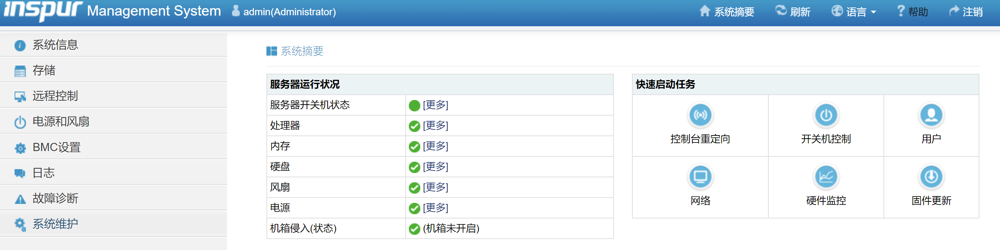

# 💻 server-remote-control
Remote power control by accessing IPMI web APIs.

## 🌴 Dependencies

Python>=3.9
- requests==2.28.2
- paramiko==3.0.0

## 🚀 QuickStart

- Use as a utility tool

```bash
# clone the code base, or you can download as `.zip` file
$ git clone https://github.com/Spico197/server-remote-control.git
# install dependencies
$ pip install -U requests paramiko
# settings
$ cp conf/server.json.example conf/server.json
# change and modify info in conf/server.json
$ vim conf/server.json
# all servers power on, 1: power is on, 0: power is off (获取服务器开机状态, 1: 开机中, 0: 关机中)
$ python run.py get_power_status -c conf/server.json
# all servers power on (全部开机)
$ python run.py power_on -c conf/server.json
# all servers power off (全部关机)
$ python run.py power_off -c conf/server.json
# all servers power reset (全部重启)
$ python run.py power_reset -c conf/server.json
# test all servers ssh connection (测试 ssh 链接)
$ python run.py ssh_ping -c conf/server.json
# get the numbers of GPUs of all servers (获取服务器 GPU 卡数)
$ python run.py get_gpu_num -c conf/server.json
```

- Use as a full-stack web app

> NOTICE: Under development, maybe 鸽了

```bash
alembic revision -m "update"
alembic upgrade head
```

## 📝 Notice

- A server may be down even the PMI system says it's on. In this case, `ServerDownException` will be thrown during `ssh_ping` or `get_gpu_num`.

## 🎐 Supported Systems

- `inspur`



- `supermicro`

API is the same as `inspur`.


- `inspur_plain`


- `megapoint`


