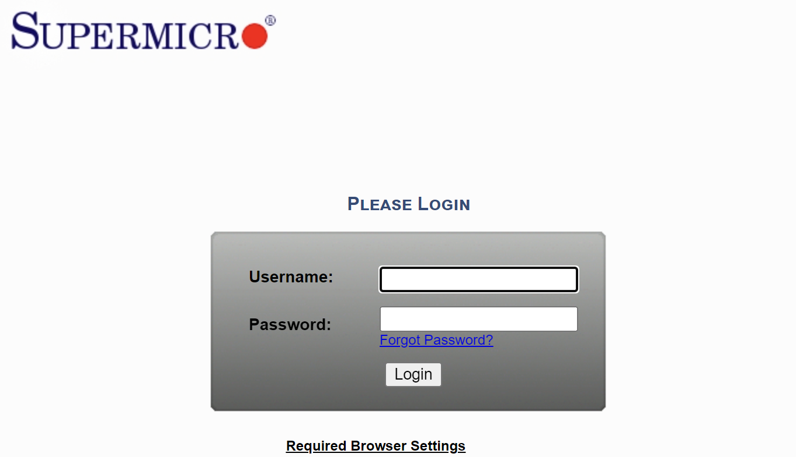
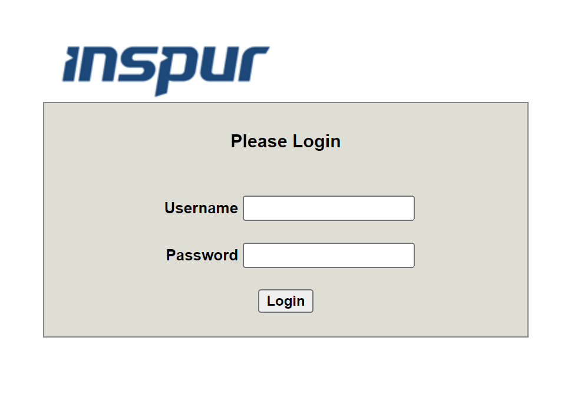
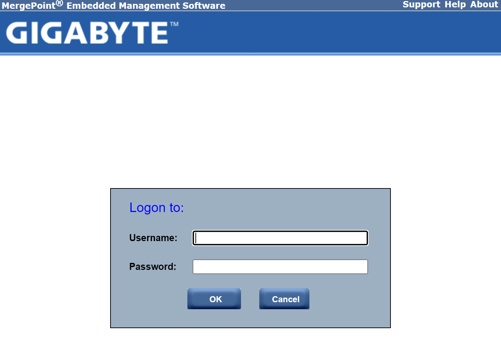

# server-remote-control
Remote power control by accessing BMI.

## Notice

- A server may be down even the PMI system says it's on.

## Supported Systems

- `inspur`


- `supermicro`

API is the same as `inspur`.



- `inspur_plain`



- `megapoint`



## QuickStart

```bash
alembic revision -m "update"
alembic upgrade head
```
